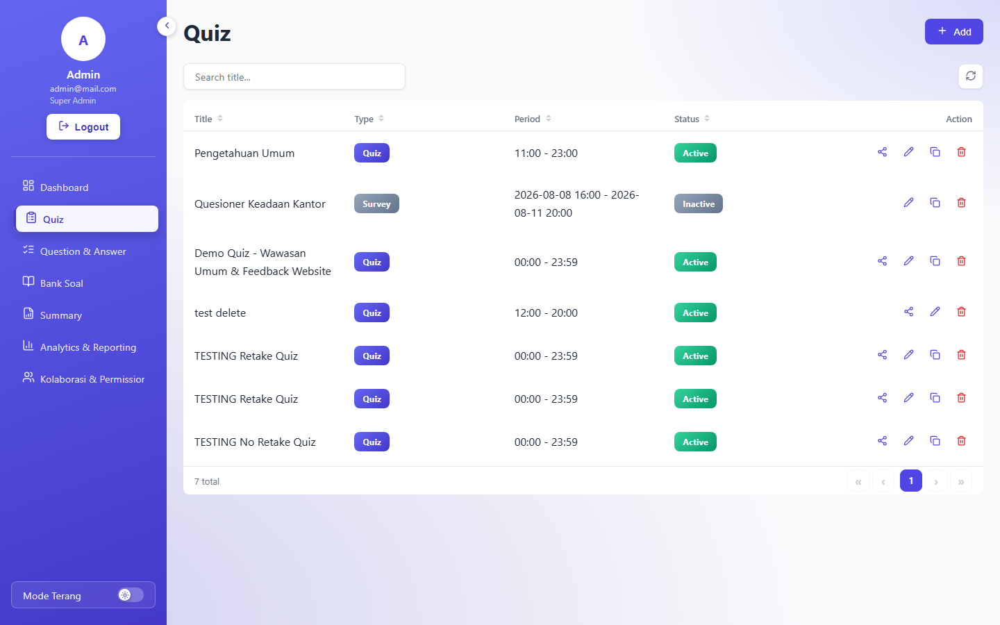
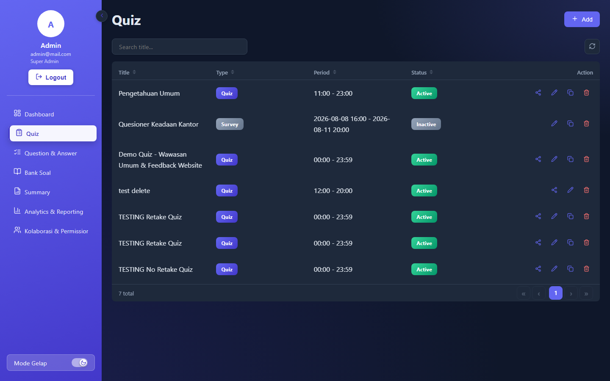
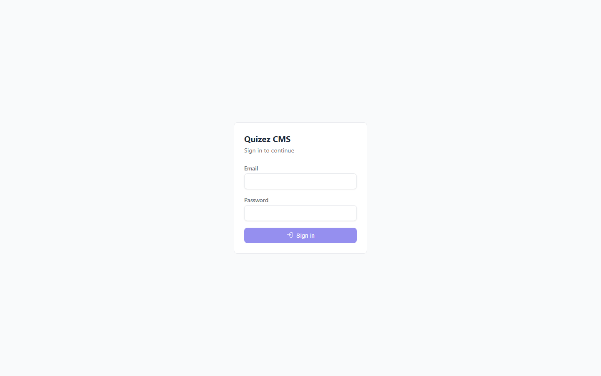
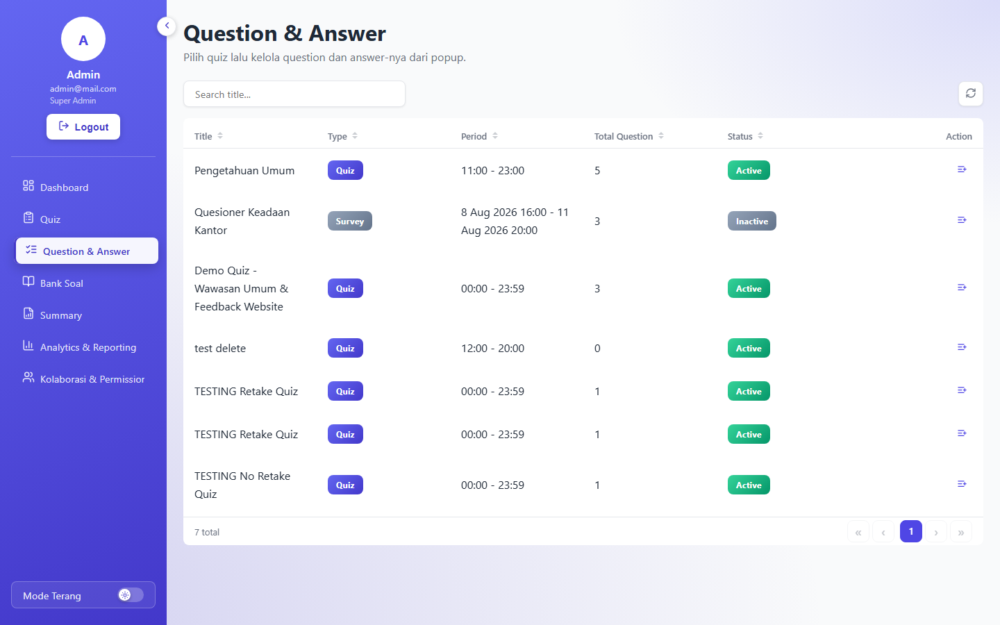
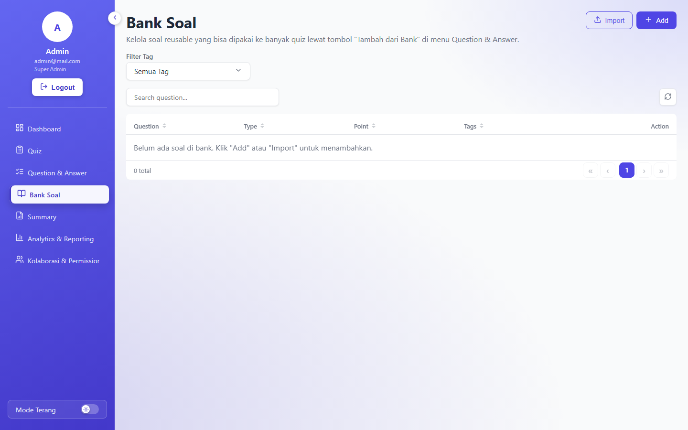
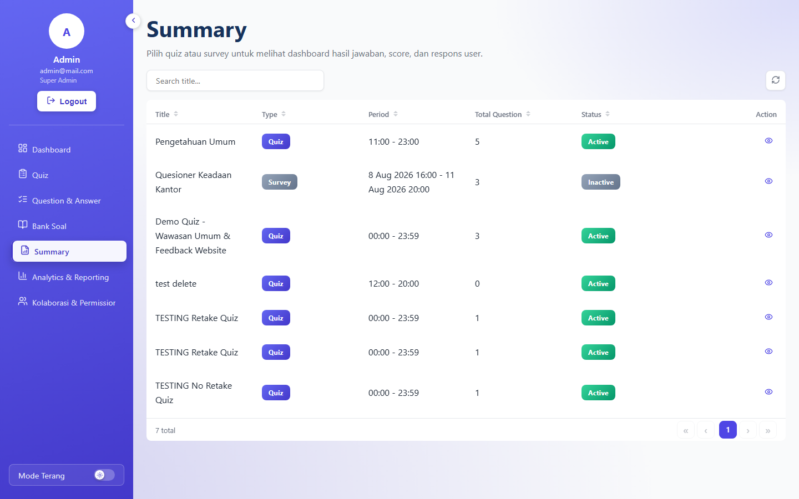
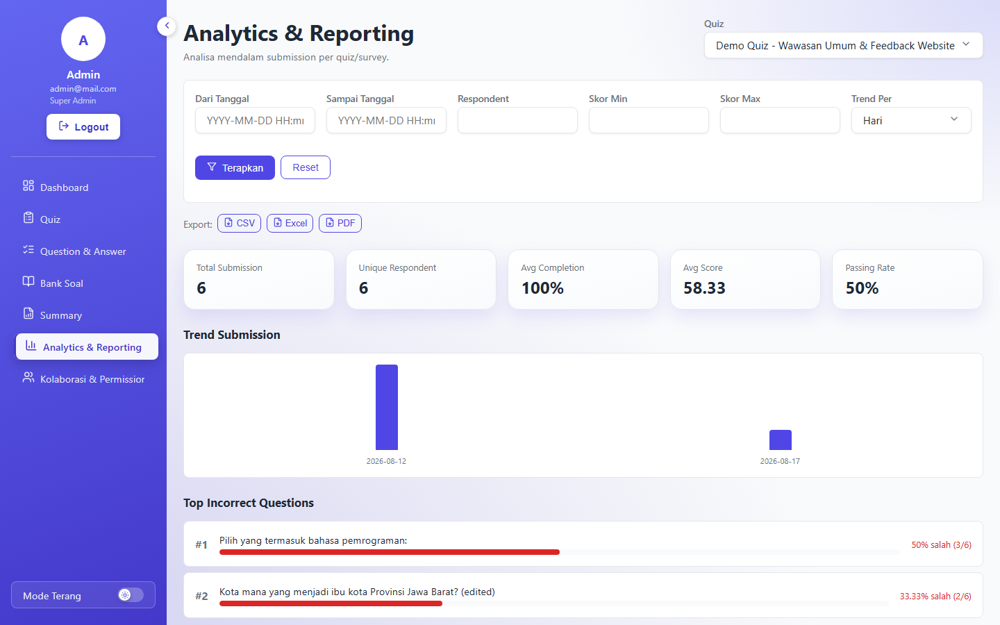
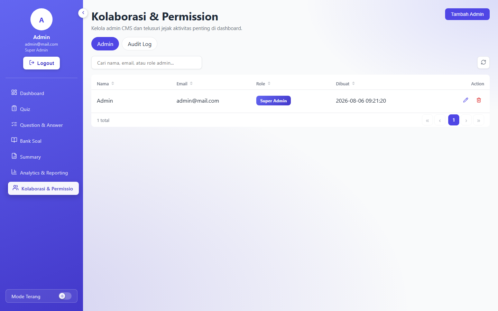

# Quizez

Full-stack Quiz & Survey CMS — **Go** (REST API) + **Angular** (admin panel) + **MySQL** — build a quiz or survey, share a link + PIN, and watch results roll in live. Respondents never need to log in.

## Tech Stack


### Backend

| Layer         | Teknologi              | Versi   |
| ------------- | ------------------------ | ------- |
| Runtime       | Go                      | 1.26.1  |
| Routing       | `net/http` + `ServeMux` | stdlib  |
| DB Driver     | go-sql-driver/mysql     | 1.10.0  |
| Auth          | golang-jwt/jwt/v5       | 5.3.1   |
| Password Hash | golang.org/x/crypto (bcrypt) | 0.54.0 |
| Env Loader    | joho/godotenv           | 1.5.1   |
| PDF Export    | go-pdf/fpdf             | 0.9.0   |
| Excel Export  | xuri/excelize/v2        | 2.11.0  |

### Frontend

| Layer         | Teknologi              | Versi   |
| ------------- | ------------------------ | ------- |
| Framework     | Angular (standalone)   | 19.2    |
| Table         | ngx-datatable           | 21.1    |
| Icons         | lucide-angular          | 0.462   |
| Date Picker   | flatpickr               | 4.6     |
| Reactive Util | RxJS                    | 7.8     |
| Language      | TypeScript              | 5.7     |

## Features

### 🪄 Public Landing Page (`/`)

A profile page explaining what Quizez does — every feature card is **clickable** and pops up its own step-by-step breakdown.


### 📋 Admin CMS (`/admin-cms`) — protected by JWT login

| Menu | Route | Fungsi |
| ---- | ----- | ------ |
| **Dashboard** | `/admin-cms` | Halaman awal setelah login. |
| **Quiz** | `/admin-cms/quiz` | Bikin & kelola quiz/survey — share link + PIN, random subset soal per sesi, anti-cheat lock mode (fullscreen wajib + auto-submit), retake policy (`max_attempts` + skor terbaik/terakhir), bahasa form publik (ID/EN), versioning & lifecycle (auto-close, duplicate jadi versi baru). |
| **Question & Answer** | `/admin-cms/question-answer` | CRUD soal per quiz — 6 tipe (pilihan ganda, rating, isian bebas, dropdown, checkbox, matrix), multiple correct answer, tombol "Tambah dari Bank Soal". |
| **Bank Soal** | `/admin-cms/question-bank` | Soal reusable lintas quiz (di luar 1 quiz manapun) — tag freeform buat pencarian, import massal via CSV/XLSX dengan validasi per baris. Reuse ke quiz = copy independen, bukan live-link. |
| **Summary** | `/admin-cms/summary` | Pilih 1 quiz/survey → lihat overview + daftar respondent, drill-down ke jawaban lengkap per submission, leaderboard (ranking skor + tie-break durasi pengerjaan). |
| **Analytics & Reporting** | `/admin-cms/analytics` | Export CSV/Excel/PDF, filter periode/respondent/skor, trend chart submission, top incorrect questions, distribusi jawaban, ringkasan sentimen jawaban bebas. |
| **Kolaborasi & Permission** | `/admin-cms/collaboration-permission` | Manajemen multi-admin (role `super_admin`/`editor`) + audit log aktivitas penting — menu ini cuma keliatan buat super admin. |

**Light & dark mode** — switch di paling bawah sidebar, cuma aktif di area CMS (persist per browser).

| Light | Dark |
| ----- | ---- |
|  |  |

### ✨ Fitur lainnya

- **Public Form** — responden isi quiz/survey lewat link + PIN tanpa perlu bikin akun, soal diacak per sesi, scoring otomatis, progress restore dari localStorage kalau browser ke-refresh.
- **Gamifikasi** — responden quiz wajib isi nama, badge tier gold/silver/bronze otomatis dari skor, sertifikat PDF bisa didownload buat quiz yang punya poin.
- **Anti-cheat** — wajib fullscreen, deteksi tab-switch/keluar fullscreen, auto-submit setelah 3x pelanggaran, dedup submission per device.
- **Retake policy** — quiz bisa diset boleh diulang sampai N kali, hasil akhir dari skor terbaik atau terakhir.

## Project Structure

```
backend/
  cmd/seed/            seeder admin default buat dev/testing
  internal/auth/        JWT + bcrypt helper
  internal/handlers/     HTTP handler per resource
  internal/models/       query SQL + business logic (scoring, analytics)
  internal/response/     helper response HTTP (JSON/Error/Paginated)
  migrations/           file .sql urut nomor

frontend/src/app/
  core/                  auth guard/interceptor, theme service
  features/admin-cms/    tiap folder = 1 menu CMS
  features/public-form/  form publik responden
  features/landing/      landing page publik di "/"
  shared/ui/             design system (button, modal, data-table, dst)
  shared/layout/         sidebar + cms-layout

docs/screenshots/       screenshot & demo GIF (dipakai README ini)
```

## Getting Started

### 1. Setup MySQL

```sql
CREATE DATABASE quizez_db;
```

Copy `backend/.env.example` ke `backend/.env` — default-nya cocok buat MySQL lokal tanpa password (`DB_USER=root`, `DB_PASSWORD=` kosong). Ganti `JWT_SECRET` kalau mau lebih aman.

### 2. Run migrations

```bash
cd backend
for f in migrations/*.sql; do mysql -u root quizez_db < "$f"; done
```

### 3. Seed admin default

```bash
cd backend
go run ./cmd/seed
```

Kredensial hardcode di `backend/cmd/seed/main.go` (`admin@mail.com` / `password123`) — jangan dipakai apa adanya kalau deploy publik.

### 4. Run backend

```bash
cd backend
go run .
```

Jalan di `http://127.0.0.1:18080` (`APP_PORT` env buat ganti port).

### 5. Run frontend

```bash
cd frontend
npm install
npm start
```

Jalan di `http://localhost:4200`. Landing page di `/`, login CMS di `/admin-cms/login`.

## Screenshots

| Login | Dashboard |
| ----- | --------- |
|  |  |

| Question & Answer | Bank Soal |
| ------------------ | --------- |
|  |  |

| Summary | Analytics & Reporting |
| ------- | ---------------------- |
|  |  |

| Kolaborasi & Permission |
| ------------------------ |
|  |
